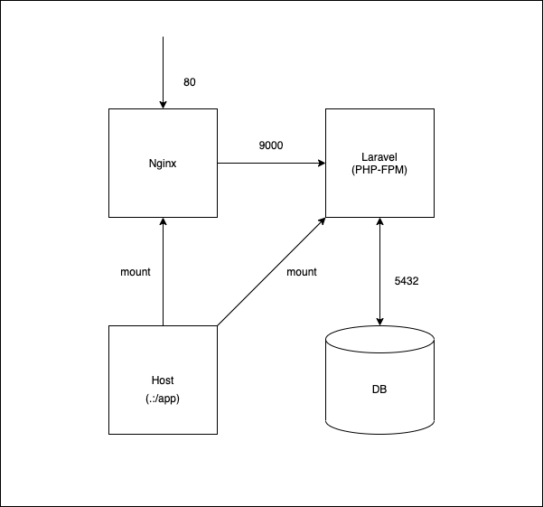

## 概要

Laravelの環境構築テンプレート

## 開発環境

* Windows 10 Home Ver. 2004
* Docker Desktop

## DockerImageのバージョン

* php:7.4-fpm-alpine
* nginx:1.19-alpine
* postgres:12

## 構成図



## Heroku への Deploy 向け

Heroku に直接 Deploy できるようにディレクトリ構成を調整してある

## ざっくり解説

.docker ディレクトリに Dockerfile と conf ファイルを準備しいる

docker-compose.yml でそれぞれのコンテナの関係を記述している

Nginx の `/app/public` と Laravel の `/app/public` が共有しているところがポイントになる

ここの共有ができていないと、静的ファイルを返す事ができない

docker-compose.yml

``` yaml
version: '3'
services:
  nginx:
    container_name: nginx
    build: .docker/nginx
    ports:

      - 80:80

    volumes:

      - .:/app

    tty: true
    restart: always
    depends_on:

      - app

  app:
    container_name: app
    build:
      context: .
      dockerfile: Dockerfile
    environment:
      LANG: 'ja_JP.UTF-8'
      TZ: 'Asia/Tokyo'
      LOG_CHANNEL: 'stderr'
      DB_CONNECTION: 'pgsql'
      DB_HOST: 'db'
      DB_PORT: '5432'
      DB_DATABASE: 'laravel_development'
      DB_USERNAME: 'docker'
      DB_PASSWORD: 'docker'
    volumes:

      - .:/app

    expose:

      - 9000

    tty: true
    restart: always
    depends_on:

      - db

  db:
    image: postgres:12
    container_name: db
    environment:
      TZ: 'Asia/Tokyo'
      POSTGRES_USER: 'docker'
      POSTGRES_PASSWORD: 'docker'
      POSTGRES_DB: 'laravel_development'
    volumes:

      - db:/var/lib/postgresql/data

    ports:

      - 5432:5432

volumes:
  db:
```

## 環境立ち上げ

``` console
docker-compose up -d
```

## Laravelのインストール

直下のディレクトリに作ろうとするとファイルが存在していて怒られるため、一度「blog」として作成する

``` console
docker-compose exec app composer create-project --prefer-dist laravel/laravel blog "8.*"
```

blog 内のファイルを直下にコピー

``` console
docker-compose exec app cp -R ./blog/. ./
```

blog を削除

``` console
docker-compose exec app rm -rf blog
```

``` console
docker-compose exec app composer install
```

ユーザーの権限だと Nginx が一時ファイルを書き出せず Laravel が止まる

そのため、一時ファイル保管にかかわる権限を permission 757 に変更する

``` console
docker-compose exec app sh
```

``` console
chmod 757 bootstrap/cache
chmod 757 storage/app/public
chmod 757 storage/framework/cache
chmod 757 storage/framework/sessions
chmod 757 storage/framework/views
chmod 757 storage/logs
```

「http://localhost」で Welcome 画面が表示されれば、環境の構築が成功となる

## Heroku に Deploy

### Heroku 側の Nginx の準備

Heroku 側で nginx を利用するため、.heroku/nginx/ に nginx.conf を準備する

※.heroku は任意のディレクトリ名でも問題ない

.heroku/nginx/nginx.conf

``` conf
location / {
    # try to serve file directory, fallback to rewrite
    try_files $uri @rewriteapp;
}

location @rewriteapp {
    # rewrite all to index.php
    rewrite ^(.*)$ /index.php/$1 last;
}
```

### Procfileの準備

プロジェクト直下に Procfile を準備する

Heroku の設定やデプロイ時のコマンドをここで記述する

Procfile

``` 

web: vendor/bin/heroku-php-nginx -C .heroku/nginx/nginx.conf public/
```

### heroku-cli のインストール

The Heroku CLI | Heroku Dev Center
https://devcenter.heroku.com/articles/heroku-cli

Scoop でもインストールできる

``` console
scoop install heroku-cli
```

### Herokuにログイン

ブラウザが立ち上がるので、ブラウザ側でログインすると Terminal 側もログイン完了となる

``` console
heroku login
```

### Herokuにアプリケーションを作成する

``` console
heroku apps:create your-app-name
```

### HerokuのBuild設定をする

Build する際に PHP と Node.js が必要になるので設定を追加する

``` console
heroku buildpacks:add heroku/php -a your-app-name
```

``` console
heroku buildpacks:add heroku/nodejs -a your-app-name
```

### Heroku に Deploy する

``` console
git push heroku main
```

###  Heroku側に環境変数をセットする

Heroku 側の環境変数に APP_KEY を set する

``` console
heroku config:set APP_KEY=your-app-key -a your-app-name
```

###  確認

``` console
heroku open
```

###  最後に

以上で開発環境と本番環境の下準備が完了

本番運用する場合は DB 設定・S3 設定・Session 設定・Mail 設定・カスタムドメイン 設定等
設定する事がまだたくさんあるが、ここでは Heroku への Deploy までとする
